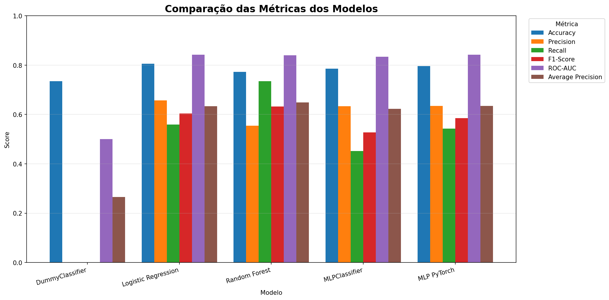
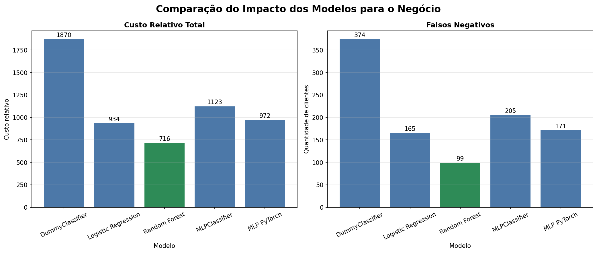

# Customer Churn Prediction — Machine Learning Engineering

**Tech Challenge — Fase 1**  
**Pós-Tech em Machine Learning Engineering — FIAP**  
**Grupo:** 56  
**Autora:** Bianca Firmino Ferreira de Sena

---

### Visão Geral

Este projeto desenvolve uma solução de Machine Learning para previsão de churn em uma operadora de telecomunicações. O objetivo é identificar clientes com maior risco de cancelamento e apoiar a priorização de ações de retenção.

O trabalho contempla o ciclo de vida de Machine Learning de ponta a ponta:

- entendimento do problema de negócio;
- análise exploratória e avaliação da qualidade dos dados;
- definição de métricas técnicas e de negócio;
- treinamento de modelos baseline e modelos candidatos;
- construção de uma rede neural MLP com PyTorch;
- análise de thresholds e custo dos erros;
- validação cruzada estratificada;
- rastreamento de experimentos com MLflow;
- persistência e validação dos artefatos;
- preparação para inferência por API REST.

O modelo central exigido pelo Tech Challenge é uma MLP implementada com PyTorch. Regressão Logística, Random Forest e MLPClassifier do Scikit-Learn são utilizados como referências comparativas.

---

### Problema de Negócio

Churn representa o cancelamento ou a saída de um cliente de um serviço. Antecipar esse comportamento permite que equipes de CRM, Customer Success e retenção direcionem ações preventivas aos clientes com maior risco.

O problema foi formulado como uma classificação binária:

- `Churn = 0`: cliente permaneceu;
- `Churn = 1`: cliente cancelou.

Os erros possuem impactos diferentes:

- **Falso Positivo (FP):** um cliente sem churn é abordado desnecessariamente;
- **Falso Negativo (FN):** um cliente com churn não é identificado, resultando em uma oportunidade de retenção perdida.

Como falsos negativos podem representar maior perda financeira, o projeto avalia diferentes thresholds e simula cenários de custo relativo.

---

### Dataset

O projeto utiliza o dataset público **Telco Customer Churn**, com informações demográficas, contratuais, financeiras e relacionadas aos serviços utilizados pelos clientes.

Características principais:

- 7.043 observações;
- 21 colunas originais;
- 19 variáveis explicativas após a remoção de `customerID` e `Churn`;
- 1.869 clientes com churn;
- taxa de churn de 26,54%;
- 11 valores ausentes em `TotalCharges`, tratados por imputação no pipeline.

O arquivo deve estar disponível em:

```text
data/raw/WA_Fn-UseC_-Telco-Customer-Churn.csv
```

---

### Objetivos

- compreender os fatores relacionados ao churn;
- avaliar a qualidade e a prontidão dos dados;
- definir métricas técnicas e de negócio;
- estabelecer referências com modelos baseline;
- construir uma MLP com PyTorch;
- implementar batching e Early Stopping;
- avaliar múltiplas métricas de classificação;
- analisar falsos positivos e falsos negativos;
- avaliar o impacto da alteração do threshold;
- aplicar validação cruzada estratificada;
- registrar parâmetros, métricas e artefatos no MLflow;
- persistir e validar o fluxo de inferência;
- comparar os modelos e selecionar o modelo recomendado para o negócio;
- disponibilizar o modelo selecionado por meio de FastAPI;
- validar os componentes críticos com testes automatizados.

---

### Metodologia

#### Etapa 1 — Entendimento e Preparação

- construção do ML Canvas;
- análise exploratória dos dados;
- avaliação de data readiness;
- definição das métricas técnicas e de negócio;
- preparação do protocolo experimental;
- construção da Regressão Logística baseline.

#### Etapa 2 — Modelagem e Avaliação

Modelos considerados:

1. DummyClassifier;
2. Regressão Logística;
3. Random Forest;
4. MLPClassifier do Scikit-Learn;
5. MLP implementada com PyTorch.

Os modelos são avaliados com o mesmo conjunto de teste e por meio de múltiplas métricas. A MLP PyTorch também utiliza um conjunto interno de validação para controlar o Early Stopping.

#### Etapa 3 — Engenharia e API

- refatoração do código experimental para `src/`;
- persistência do modelo e do pré-processador;
- implementação de inferência reutilizável;
- criação da API FastAPI;
- endpoints `GET /health` e `POST /predict`;
- validação das entradas com Pydantic;
- logging estruturado e monitoramento de latência;
- testes automatizados.

#### Etapa 4 — Documentação e Entrega

- atualização do README;
- elaboração do Model Card;
- documentação da arquitetura de inferência;
- plano de monitoramento;
- roteiro e gravação do vídeo pelo método STAR.

---

### Pré-processamento

O pipeline de pré-processamento utiliza Scikit-Learn e é ajustado exclusivamente sobre os dados de treino.

Variáveis numéricas:

- imputação pela mediana;
- padronização com `StandardScaler`.

Variáveis categóricas:

- imputação pelo valor mais frequente;
- One-Hot Encoding;
- tratamento de categorias desconhecidas.

Após o pré-processamento, as 19 variáveis explicativas originam 45 features numéricas no experimento atual.

---

### MLP com PyTorch

A rede neural central foi implementada explicitamente com `torch.nn.Module`.

Arquitetura:

```text
45 features
    ↓
Linear(45, 64) + ReLU + Dropout(20%)
    ↓
Linear(64, 32) + ReLU + Dropout(20%)
    ↓
Linear(32, 1)
    ↓
Logit de churn
```

Configuração do treinamento:

- 5.057 parâmetros treináveis;
- `BCEWithLogitsLoss`;
- otimizador Adam;
- learning rate de 0,001;
- regularização L2 de 0,0001;
- batch size de 32;
- máximo de 300 épocas;
- paciência de 20 épocas;
- restauração dos melhores pesos.

O Early Stopping encerrou o treinamento após 29 épocas. A melhor loss de validação foi obtida na época 9.

---

### Estratégia de Avaliação

A métrica técnica prioritária é a **Average Precision**, utilizada como resumo da curva Precision-Recall devido à distribuição desigual da classe positiva.

Também são avaliadas:

- Accuracy;
- Precision;
- Recall;
- F1-Score;
- ROC-AUC;
- matriz de confusão;
- loss de validação e teste;
- estabilidade na validação cruzada;
- custo relativo de falsos positivos e falsos negativos.

A seleção do modelo recomendado não foi baseada exclusivamente em uma única métrica. Também foram considerados estabilidade, capacidade de generalização, impacto dos erros, interpretabilidade e complexidade operacional.

---

### Comparação dos Modelos

Os cinco modelos foram avaliados no mesmo conjunto de teste, com 1.409 observações e threshold padrão de 0,50.

| Modelo | Accuracy | Precision | Recall | F1-Score | ROC-AUC | Average Precision |
|---|---:|---:|---:|---:|---:|---:|
| DummyClassifier | 0,7346 | 0,0000 | 0,0000 | 0,0000 | 0,5000 | 0,2654 |
| Regressão Logística | **0,8055** | **0,6572** | 0,5588 | 0,6040 | **0,8419** | 0,6334 |
| Random Forest | 0,7729 | 0,5544 | **0,7353** | **0,6322** | 0,8401 | **0,6492** |
| MLPClassifier | 0,7850 | 0,6330 | 0,4519 | 0,5273 | 0,8341 | 0,6231 |
| MLP PyTorch | 0,7956 | 0,6344 | 0,5428 | 0,5850 | **0,8419** | 0,6349 |

A Regressão Logística apresentou a maior Accuracy e Precision. O Random Forest obteve o maior Recall, F1-Score e Average Precision. A MLP PyTorch empatou com a Regressão Logística no maior ROC-AUC e permaneceu como o modelo neural central do projeto.

#### Impacto dos erros no negócio

Foi simulada uma relação de custo de 1 para Falso Positivo e 5 para Falso Negativo.

| Modelo | FP | FN | Custo relativo total |
|---|---:|---:|---:|
| DummyClassifier | 0 | 374 | 1.870 |
| Regressão Logística | 109 | 165 | 934 |
| Random Forest | 221 | **99** | **716** |
| MLPClassifier | 98 | 205 | 1.123 |
| MLP PyTorch | 117 | 171 | 972 |

O Random Forest foi selecionado como modelo recomendado para o cenário de negócio porque apresentou a menor quantidade de Falsos Negativos, o menor custo relativo total e o melhor equilíbrio entre Recall, F1-Score e Average Precision.

Essa decisão não substitui a MLP PyTorch como modelo neural central exigido pelo desafio. Os dois modelos cumprem papéis complementares na solução.

#### Visualizações consolidadas





---

### Resultados da MLP PyTorch

#### Hold-out — threshold 0,50

| Métrica | Resultado |
|---|---:|
| Accuracy | 0,7956 |
| Precision | 0,6344 |
| Recall | 0,5428 |
| F1-Score | 0,5850 |
| ROC-AUC | 0,8419 |
| Average Precision | 0,6349 |
| Test Loss | 0,4204 |

Matriz de confusão:

| Resultado | Quantidade |
|---|---:|
| Verdadeiros Negativos | 918 |
| Falsos Positivos | 117 |
| Falsos Negativos | 171 |
| Verdadeiros Positivos | 203 |

#### Validação cruzada estratificada — cinco folds

| Métrica | Média | Desvio-padrão |
|---|---:|---:|
| Accuracy | 0,8012 | 0,0112 |
| Precision | 0,6537 | 0,0271 |
| Recall | 0,5340 | 0,0200 |
| F1-Score | 0,5878 | 0,0226 |
| ROC-AUC | 0,8419 | 0,0150 |
| Average Precision | 0,6488 | 0,0288 |

Os resultados do hold-out permaneceram dentro da variação observada nos folds, fornecendo evidências de desempenho consistente.

#### Thresholds de referência

| Critério | Threshold | Resultado principal |
|---|---:|---:|
| Padrão | 0,50 | F1 = 0,5850 |
| Melhor F1 entre os avaliados | 0,30 | F1 = 0,6215 |
| Menor custo na simulação 1:5 | 0,20 | Custo relativo = 621 |

Na simulação em que um falso negativo custa cinco vezes mais que um falso positivo, o threshold de 0,20 reduziu o custo relativo em 36,11% quando comparado ao threshold padrão.

Os custos utilizados são hipotéticos e deverão ser substituídos por valores observados em uma aplicação real.

---

### Persistência dos Artefatos

O experimento da MLP PyTorch produz:

```text
models/
├── mlp_pytorch_state_dict.pt
├── mlp_pytorch_preprocessor.joblib
└── mlp_pytorch_metadata.json
```

O teste de recarregamento confirmou que o modelo reconstruído reproduz exatamente as probabilidades originais, com diferença máxima igual a zero.

Os arquivos de modelos não são versionados diretamente no Git. Eles podem ser reproduzidos pela execução do notebook e são registrados como artefatos no MLflow.

---

### Rastreamento com MLflow

O notebook `08_mlflow_experimentos.ipynb` centraliza o rastreamento dos cinco modelos no experimento `churn-prediction-model-comparison`.

O rastreamento utiliza:

- backend SQLite para armazenar execuções, parâmetros, métricas e tags;
- diretório local para os artefatos gerenciados pelo MLflow;
- uma execução independente para cada modelo;
- métricas do conjunto de teste;
- componentes das matrizes de confusão;
- custos relativos de Falsos Positivos e Falsos Negativos;
- médias e desvios-padrão da validação cruzada, quando disponíveis;
- parâmetros gerais e configurações específicas dos modelos;
- tags para identificar o modelo recomendado e o modelo neural central;
- tabelas, resumos em JSON e gráficos comparativos como artefatos.

O Random Forest foi registrado com a tag `recommended_for_business=true`, enquanto a MLP PyTorch foi registrada com `central_neural_model=true`.

Para iniciar a interface local:

```bash
mlflow ui \
  --backend-store-uri sqlite:///mlflow.db \
  --host 127.0.0.1 \
  --port 5000
```

Depois, acesse `http://127.0.0.1:5000`.

O banco `mlflow.db` e o diretório `mlartifacts/` são locais e não devem ser versionados. Os relatórios consolidados utilizados na documentação estão disponíveis em `reports/mlflow_experiments/`.

---

### Estrutura do Projeto

```text
churn-prediction-mle/
├── artifacts/
│   ├── figures/
│   └── metrics/
├── data/
│   ├── processed/
│   └── raw/
├── docs/
│   ├── ml_canvas.md
│   ├── model_card.md
│   └── star_video_script.md
├── models/
├── notebooks/
│   ├── 01_eda.ipynb
│   ├── 02_metricas_negocio_tecnicas.ipynb
│   ├── 03_baseline_logistic_regression.ipynb
│   ├── 04_random_forest.ipynb
│   ├── 05_mlp_classifier.ipynb
│   ├── 06_mlp_pytorch.ipynb
│   ├── 07_comparacao_modelos.ipynb
│   └── 08_mlflow_experimentos.ipynb
├── reports/
│   └── mlflow_experiments/
│       ├── business_impact_comparison.png
│       ├── cross_validation_results.csv
│       ├── experiment_summary.json
│       ├── holdout_results.csv
│       └── model_metrics_comparison.png
├── src/
│   └── churn_prediction/
│       ├── api/
│       ├── data/
│       ├── features/
│       └── modeling/
├── tests/
├── .gitignore
├── pyproject.toml
└── README.md
```

---

### Notebooks

1. `01_eda.ipynb` — análise exploratória e data readiness;
2. `02_metricas_negocio_tecnicas.ipynb` — métricas técnicas, erros e impacto de negócio;
3. `03_baseline_logistic_regression.ipynb` — baseline de Regressão Logística;
4. `04_random_forest.ipynb` — modelo ensemble e importância das variáveis;
5. `05_mlp_classifier.ipynb` — experimento adicional com MLPClassifier;
6. `06_mlp_pytorch.ipynb` — MLP central em PyTorch, Early Stopping, thresholds, validação cruzada, persistência e MLflow;
7. `07_comparacao_modelos.ipynb` — comparação consolidada e seleção do modelo recomendado;
8. `08_mlflow_experimentos.ipynb` — rastreamento, comparação e auditoria dos experimentos com MLflow.

---

### Instalação

Requisitos:

- Python 3.11 ou 3.12;
- Git;
- ambiente virtual recomendado.

Clone o repositório e entre no diretório:

```bash
git clone <URL_DO_REPOSITORIO>
cd churn-prediction-mle
```

Crie e ative um ambiente virtual com Conda:

```bash
conda create -n churn-mle python=3.11 -y
conda activate churn-mle
```

Instale o projeto com as dependências de desenvolvimento:

```bash
python -m pip install --upgrade pip
python -m pip install -e ".[dev]"
```

Valide as dependências:

```bash
python -m pip check
```

---

### Execução dos Notebooks

Inicie o Jupyter:

```bash
jupyter lab
```

Execute os notebooks na ordem numérica. O dataset deve estar disponível em `data/raw/` antes da execução.

---

### API

A etapa de engenharia disponibilizará os endpoints:

- `GET /health` — verificação da disponibilidade da aplicação;
- `POST /predict` — recebimento das características do cliente e retorno da probabilidade e classe previstas.

As entradas serão validadas com Pydantic. O modelo e o pré-processador serão carregados uma única vez na inicialização da aplicação.

**Status atual:** implementação pendente.

---

### Testes e Qualidade

O projeto utilizará Pytest para validar, no mínimo:

- schema e pré-processamento;
- carregamento dos artefatos;
- smoke test de inferência;
- endpoint `/health`;
- endpoint `/predict`.

O Ruff será utilizado para linting do código produtivo.

Comandos planejados:

```bash
ruff check .
pytest
```

**Status atual:** implementação dos testes pendente.

---

### Tecnologias

- Python;
- Pandas e NumPy;
- Scikit-Learn;
- PyTorch;
- Matplotlib;
- Joblib;
- MLflow;
- SQLite;
- FastAPI;
- Pydantic;
- Uvicorn;
- Pytest;
- Ruff;
- Jupyter Notebook.

---

### Reprodutibilidade

O projeto adota:

- dependências declaradas no `pyproject.toml`;
- Python entre 3.11 e 3.12;
- seeds fixadas em 42;
- algoritmos determinísticos no PyTorch;
- divisão estratificada;
- pré-processamento ajustado somente no treino;
- validação cruzada estratificada;
- hash do dataset no MLflow;
- persistência do pré-processador, pesos e metadados;
- teste de recarregamento dos artefatos.

---

### Documentação

Documentos previstos em `docs/`:

- `ml_canvas.md` — planejamento do problema e da solução;
- `model_card.md` — desempenho, limitações, riscos e usos recomendados;
- `star_video_script.md` — roteiro da apresentação final.

---

### Status do Projeto

🚧 **Em desenvolvimento**

Concluído:

- ✅ estrutura inicial do repositório;
- ✅ ML Canvas;
- ✅ análise exploratória e data readiness;
- ✅ métricas técnicas e de negócio;
- ✅ Regressão Logística baseline;
- ✅ Random Forest;
- ✅ MLPClassifier do Scikit-Learn;
- ✅ MLP com PyTorch;
- ✅ batching e Early Stopping;
- ✅ análise de thresholds e custo relativo;
- ✅ validação cruzada estratificada da MLP PyTorch;
- ✅ persistência e validação dos artefatos da MLP PyTorch;
- ✅ DummyClassifier como baseline mínimo;
- ✅ comparação consolidada dos cinco modelos;
- ✅ seleção do Random Forest como modelo recomendado para o negócio;
- ✅ definição da MLP PyTorch como modelo neural central;
- ✅ rastreamento consolidado dos cinco modelos no MLflow;
- ✅ registro de parâmetros, métricas, tags e artefatos;
- ✅ auditoria e organização das execuções do MLflow;
- ✅ relatórios comparativos versionados em `reports/mlflow_experiments/`.

Em andamento ou pendente:

- ⏳ refatoração completa em `src/`;
- ⏳ API FastAPI;
- ⏳ testes automatizados;
- ⏳ logging estruturado;
- ⏳ Model Card e plano de monitoramento;
- ⏳ vídeo STAR.

---

### Autora

**Bianca Firmino Ferreira de Sena**

Projeto desenvolvido como parte da Pós-Tech em Machine Learning Engineering da FIAP.
