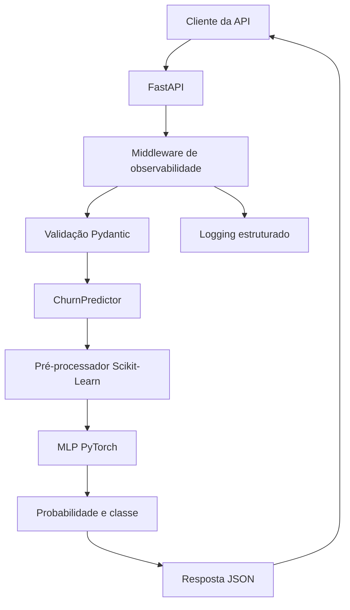
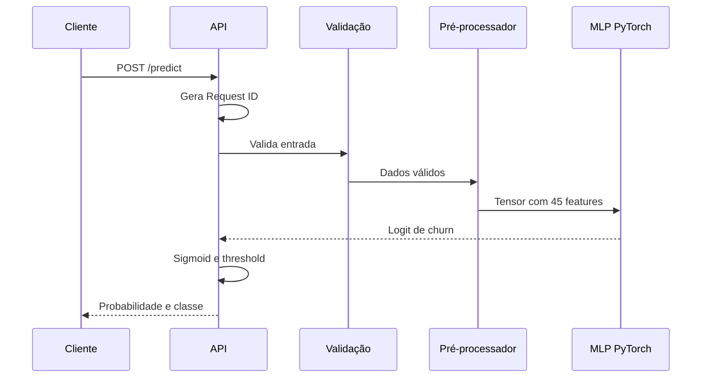
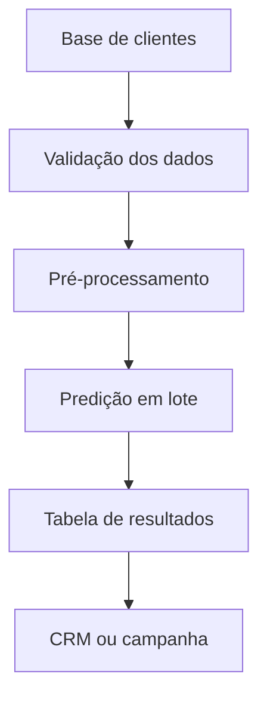

## Arquitetura de Inferência — Customer Churn Prediction

### 1. Visão Geral

Este documento descreve a arquitetura utilizada para disponibilizar previsões de churn por meio de uma API REST desenvolvida com FastAPI.

A solução utiliza a MLP implementada com PyTorch como modelo neural de inferência.

O Random Forest permanece registrado como modelo recomendado para o cenário de negócio devido ao maior Recall, maior Average Precision, menor número de Falsos Negativos e menor custo relativo. Entretanto, a MLP PyTorch é o modelo neural central exigido pelo Tech Challenge e foi utilizada na implementação da API.

Os dois modelos possuem papéis complementares:

- **Random Forest:** modelo recomendado para priorização das ações de retenção;
- **MLP PyTorch:** modelo neural central disponibilizado pela API de inferência.

---

### 2. Objetivo da Arquitetura

A arquitetura foi projetada para:

- receber as características de um cliente;
- validar os dados de entrada;
- aplicar o mesmo pré-processamento utilizado no treinamento;
- reconstruir e carregar a MLP PyTorch;
- calcular a probabilidade de churn;
- aplicar o threshold de classificação;
- devolver uma resposta estruturada;
- registrar eventos e latência da requisição;
- permitir rastreamento por meio de um identificador único;
- manter os artefatos carregados durante todo o ciclo de vida da aplicação.

---

### 3. Componentes da Solução

A arquitetura é composta pelos seguintes componentes:

| Componente | Responsabilidade |
|---|---|
| Cliente da API | Envia os dados do cliente para classificação |
| FastAPI | Recebe a requisição e coordena o fluxo de inferência |
| Pydantic | Valida tipos, valores permitidos, campos obrigatórios e campos adicionais |
| Middleware de observabilidade | Gera o Request ID, mede a latência e registra o resultado da requisição |
| ChurnPredictor | Coordena o carregamento dos artefatos e a inferência |
| ColumnTransformer | Aplica imputação, padronização e One-Hot Encoding |
| ChurnMLP | Executa a rede neural treinada em PyTorch |
| Metadados | Armazena arquitetura, métricas, thresholds e informações do treinamento |
| Logging estruturado | Registra eventos operacionais em formato JSON |
| Testes automatizados | Validam schemas, inferência, endpoints e observabilidade |

---

### 4. Visão da Arquitetura



---

### 5. Fluxo de Inicialização

A aplicação utiliza o mecanismo de `lifespan` do FastAPI para carregar os artefatos durante sua inicialização.

Fluxo:

1. a aplicação FastAPI é iniciada;
2. o evento de inicialização é registrado;
3. o `ChurnPredictor` é criado;
4. os metadados são carregados;
5. o pré-processador treinado é carregado;
6. a arquitetura da MLP é reconstruída;
7. os pesos treinados são carregados;
8. o modelo é movido para o dispositivo configurado;
9. o modelo é colocado em modo de avaliação;
10. o serviço fica disponível para receber requisições.

Os artefatos são carregados somente uma vez, evitando a leitura dos arquivos e a reconstrução do modelo em cada previsão.

Caso algum artefato não possa ser carregado, a inicialização é interrompida e o erro é registrado.

---

### 6. Artefatos Utilizados

A API utiliza os seguintes arquivos:

```text
models/
├── mlp_pytorch_state_dict.pt
├── mlp_pytorch_preprocessor.joblib
└── mlp_pytorch_metadata.json
```

#### `mlp_pytorch_state_dict.pt`

Contém:

- pesos treinados;
- tamanho da entrada;
- quantidade de neurônios das camadas ocultas;
- taxa de Dropout;
- versão do PyTorch utilizada.

#### `mlp_pytorch_preprocessor.joblib`

Contém o `ColumnTransformer` ajustado no treinamento, incluindo:

- imputação das variáveis numéricas;
- padronização das variáveis numéricas;
- imputação das variáveis categóricas;
- One-Hot Encoding;
- ordem esperada das variáveis de entrada.

#### `mlp_pytorch_metadata.json`

Contém:

- nome do modelo;
- framework;
- arquitetura;
- hiperparâmetros;
- métricas do hold-out;
- resultados da validação cruzada;
- thresholds de referência;
- nomes das features processadas.

---

### 7. Fluxo de uma Requisição

O fluxo de uma previsão ocorre da seguinte forma:



Etapas detalhadas:

1. o cliente envia uma requisição para `POST /predict`;
2. o middleware recebe ou gera um `X-Request-ID`;
3. o tempo inicial da requisição é registrado;
4. o Pydantic valida os 19 campos de entrada;
5. campos ausentes, adicionais ou inválidos são rejeitados;
6. os dados são convertidos para um DataFrame;
7. `TotalCharges` é convertido para formato numérico;
8. o pré-processador transforma as 19 variáveis em 45 features;
9. os dados são convertidos para `float32`;
10. as features são convertidas para um tensor PyTorch;
11. a MLP calcula o logit de churn;
12. a função sigmoid transforma o logit em probabilidade;
13. o threshold determina a classe prevista;
14. a API monta a resposta;
15. a latência é calculada;
16. o evento é registrado por logging;
17. a resposta é devolvida com os headers de observabilidade.

---

### 8. Contrato de Entrada

O endpoint `POST /predict` recebe 19 características.

Exemplo:

```json
{
  "gender": "Female",
  "SeniorCitizen": 0,
  "Partner": "Yes",
  "Dependents": "No",
  "tenure": 1,
  "PhoneService": "No",
  "MultipleLines": "No phone service",
  "InternetService": "DSL",
  "OnlineSecurity": "No",
  "OnlineBackup": "Yes",
  "DeviceProtection": "No",
  "TechSupport": "No",
  "StreamingTV": "No",
  "StreamingMovies": "No",
  "Contract": "Month-to-month",
  "PaperlessBilling": "Yes",
  "PaymentMethod": "Electronic check",
  "MonthlyCharges": 29.85,
  "TotalCharges": 29.85
}
```

As validações incluem:

- presença dos 19 campos;
- rejeição de campos adicionais;
- validação dos tipos;
- validação dos valores categóricos permitidos;
- validação dos limites das variáveis numéricas;
- validação de `tenure` entre 0 e 72;
- validação das cobranças mensais e totais.

Entradas inválidas retornam o código HTTP `422`.

---

### 9. Contrato de Saída

Exemplo de resposta:

```json
{
  "churn_probability": 0.5922411680221558,
  "churn_prediction": 1,
  "churn_label": "Churn",
  "threshold": 0.5,
  "model_name": "ChurnMLP",
  "model_version": "1.0.0",
  "processing_time_ms": 25.49
}
```

Campos retornados:

| Campo | Descrição |
|---|---|
| `churn_probability` | Probabilidade prevista de churn |
| `churn_prediction` | Classe binária prevista |
| `churn_label` | Descrição da classe prevista |
| `threshold` | Threshold utilizado na classificação |
| `model_name` | Nome do modelo |
| `model_version` | Versão lógica do modelo |
| `processing_time_ms` | Tempo interno da inferência em milissegundos |

---

### 10. Endpoints

#### `GET /`

Retorna informações básicas da aplicação e os caminhos principais.

#### `GET /health`

Verifica:

- disponibilidade da API;
- carregamento do modelo;
- nome do modelo;
- versão da aplicação.

Exemplo:

```json
{
  "status": "healthy",
  "model_loaded": true,
  "model_name": "ChurnMLP",
  "api_version": "0.1.0"
}
```

#### `POST /predict`

Recebe as características de um cliente e retorna a probabilidade e a classe previstas.

#### `GET /docs`

Disponibiliza a documentação interativa Swagger.

#### `GET /redoc`

Disponibiliza a documentação alternativa ReDoc.

---

### 11. Estratégia de Inferência

A arquitetura principal utiliza **inferência síncrona em tempo real**.

Essa abordagem foi escolhida porque a previsão pode ser solicitada durante uma interação com o cliente, por exemplo:

- atendimento em um canal digital;
- operação de Customer Success;
- consulta por uma equipe de retenção;
- integração com um sistema de CRM;
- priorização individual durante um contato.

A API retorna a previsão imediatamente após o recebimento e a validação dos dados.

---

### 12. Justificativa para Inferência em Tempo Real

A inferência em tempo real é adequada neste projeto porque:

- a MLP possui apenas 5.057 parâmetros;
- a entrada possui somente 45 features processadas;
- a previsão utiliza uma única passagem pela rede;
- o modelo é mantido carregado em memória;
- o pré-processamento possui baixo custo computacional;
- não existe cálculo de gradientes durante a inferência;
- o resultado pode ser utilizado imediatamente em uma interação operacional.

O processamento utiliza:

```python
model.eval()
```

e:

```python
torch.inference_mode()
```

Essas configurações desativam o comportamento de treinamento e evitam cálculos desnecessários.

---

### 13. Possibilidade de Inferência em Lote

Apesar da escolha pela API em tempo real, a mesma classe `ChurnPredictor` aceita múltiplos registros e pode ser reutilizada em processamento em lote.

O modo batch seria indicado para:

- classificar toda a carteira de clientes;
- gerar listas diárias de clientes prioritários;
- executar campanhas periódicas;
- alimentar tabelas analíticas;
- integrar resultados a plataformas de CRM;
- reduzir o número de chamadas individuais.

Fluxo sugerido para processamento em lote:



Em uma evolução da solução, o processamento batch poderá ser executado por:

- job agendado;
- pipeline de dados;
- serviço de orquestração;
- ferramenta de processamento distribuído;
- rotina diária ou semanal.

---

### 14. Comparação entre Tempo Real e Batch

| Critério | Tempo real | Batch |
|---|---|---|
| Unidade de processamento | Um ou poucos clientes | Carteira completa |
| Latência esperada | Baixa | Não crítica |
| Principal uso | Atendimento e consulta imediata | Campanhas e segmentações periódicas |
| Interface | API REST | Job ou pipeline |
| Frequência | Sob demanda | Agendada |
| Escalabilidade | Réplicas da API | Particionamento dos dados |
| Modelo utilizado | Mesmo modelo persistido | Mesmo modelo persistido |

A estratégia recomendada é híbrida:

- API em tempo real para decisões individuais;
- processamento em lote para campanhas e priorização de carteira.

---

### 15. Observabilidade

A API possui middleware para registrar informações sobre cada requisição.

São coletados:

- evento;
- método HTTP;
- caminho;
- status da resposta;
- Request ID;
- tempo total de processamento;
- resultado da previsão;
- probabilidade;
- threshold;
- falhas de validação;
- erros inesperados.

Os logs são emitidos em formato JSON, facilitando a integração futura com plataformas de observabilidade.

---

### 16. Rastreamento de Requisições

Cada requisição recebe um identificador único.

Header de resposta:

```text
X-Request-ID
```

Se o cliente enviar esse header, o identificador recebido poderá ser preservado.

Caso contrário, a API gera um UUID sem separadores.

O identificador permite relacionar:

- requisição recebida;
- eventos de inferência;
- erros;
- tempo de processamento;
- resposta devolvida.

---

### 17. Monitoramento de Latência

O middleware mede o tempo total da requisição.

Header de resposta:

```text
X-Process-Time-Ms
```

A resposta do endpoint de previsão também possui:

```text
processing_time_ms
```

Os valores possuem funções diferentes:

- `X-Process-Time-Ms`: tempo total medido pelo middleware;
- `processing_time_ms`: tempo interno do fluxo de inferência.

Essa separação ajuda a identificar se o aumento da latência ocorreu no modelo ou em outra etapa da aplicação.

---

### 18. Tratamento de Erros

A arquitetura trata os seguintes cenários:

| Cenário | Código HTTP |
|---|---:|
| Requisição válida | 200 |
| Schema ou campo inválido | 422 |
| Erro durante a preparação da entrada | 422 |
| Modelo indisponível | 503 |
| Falha inesperada na inferência | 500 |

Os detalhes técnicos completos não devem ser enviados ao consumidor da API em um ambiente produtivo.

As informações necessárias para investigação devem permanecer nos logs internos.

---

### 19. Segurança e Privacidade

Para uma implantação real, são recomendados:

- utilização de HTTPS;
- autenticação e autorização;
- controle de acesso por função;
- armazenamento seguro dos artefatos;
- validação do tamanho das requisições;
- limitação de requisições;
- proteção contra abuso;
- gestão de segredos por variáveis de ambiente;
- remoção de dados pessoais dos logs;
- políticas de retenção dos logs;
- auditoria de acessos;
- adequação à LGPD.

O endpoint não deve registrar o conteúdo completo dos dados dos clientes.

---

### 20. Escalabilidade

A API não mantém estado específico de cada cliente e pode ser replicada horizontalmente.

Possíveis evoluções:

- execução com múltiplos workers;
- criação de uma imagem Docker;
- utilização de balanceador de carga;
- implantação em Kubernetes ou serviço gerenciado;
- cache de respostas quando aplicável;
- autoscaling baseado em CPU, memória ou volume de requisições;
- armazenamento dos artefatos em repositório central;
- registro e versionamento dos modelos;
- implantação automatizada por CI/CD.

Como os artefatos são carregados por processo, o consumo de memória deve ser considerado ao aumentar a quantidade de workers.

---

### 21. Disponibilidade

O endpoint `GET /health` permite validar se:

- a aplicação está respondendo;
- o preditor foi inicializado;
- o modelo está carregado.

Em uma infraestrutura de produção, esse endpoint poderá ser utilizado por:

- balanceadores de carga;
- Kubernetes;
- serviços de monitoramento;
- pipelines de implantação;
- mecanismos de reinicialização automática.

---

### 22. Versionamento

A resposta da API informa:

- versão da aplicação;
- versão lógica do modelo;
- nome do modelo.

Em uma evolução, recomenda-se incluir:

- hash dos artefatos;
- data do treinamento;
- versão do dataset;
- versão do pré-processador;
- Run ID do MLflow;
- assinatura do modelo;
- estágio de implantação.

Essas informações permitem identificar exatamente qual modelo produziu cada previsão.

---

### 23. Testes da Arquitetura

A arquitetura foi validada por testes automatizados que cobrem:

- rota principal;
- endpoint de saúde;
- endpoint de previsão;
- campos obrigatórios;
- rejeição de campos adicionais;
- limites das variáveis;
- carregamento dos artefatos;
- formato das features processadas;
- reconstrução da MLP;
- cálculo das probabilidades;
- headers de observabilidade;
- geração do Request ID;
- medição da latência.

Situação atual:

```text
44 passed
```

Validação estática:

```text
All checks passed!
```

---

### 24. Execução Local

Para iniciar a API:

```bash
make run-api
```

Comando equivalente:

```bash
python -m uvicorn churn_prediction.api.main:app \
  --host 127.0.0.1 \
  --port 8000 \
  --reload
```

Documentação Swagger:

```text
http://127.0.0.1:8000/docs
```

Verificação de saúde:

```text
http://127.0.0.1:8000/health
```

---

### 25. Limitações Atuais

A arquitetura atual possui as seguintes limitações:

- execução apenas em ambiente local;
- ausência de autenticação;
- ausência de rate limiting;
- ausência de balanceamento de carga;
- ausência de armazenamento centralizado dos logs;
- ausência de métricas exportadas para uma plataforma de monitoramento;
- ausência de implantação em nuvem;
- ausência de endpoint específico para processamento em lote;
- ausência de registro automático do feedback real;
- modelo da API fixado na MLP PyTorch.

Essas limitações devem ser tratadas antes de uma utilização produtiva.

---

### 26. Evoluções Recomendadas

Próximas evoluções possíveis:

1. criar imagem Docker da aplicação;
2. adicionar autenticação;
3. adicionar endpoint batch;
4. exportar métricas para Prometheus;
5. criar dashboards no Grafana;
6. centralizar logs;
7. implantar em ambiente de nuvem;
8. configurar CI/CD;
9. integrar o Model Registry do MLflow;
10. registrar feedback e resultados reais;
11. monitorar drift;
12. permitir a seleção controlada da versão do modelo;
13. disponibilizar o Random Forest recomendado para o negócio;
14. realizar testes de carga e desempenho.

---

### 27. Conclusão

A arquitetura disponibiliza a MLP PyTorch por meio de uma API REST simples, validada e reutilizável.

O carregamento único dos artefatos, a validação com Pydantic, o modo de inferência do PyTorch, o tratamento de erros e o middleware de observabilidade fornecem uma base segura para a evolução da solução.

A inferência em tempo real foi escolhida pela baixa complexidade computacional do modelo e pela possibilidade de utilização imediata durante interações com clientes.

Para cenários de campanhas e classificação de toda a carteira, a mesma camada de inferência poderá ser reutilizada em processamento batch.

---